# Quantum-Safe Encryption Demo

A frontend web application demonstrating post-quantum cryptography using Classic McEliece combined with AES-GCM hybrid encryption.


## Overview

This demo showcases quantum-resistant asymmetric encryption using:

- **Classic McEliece (8192128)** - A key encapsulation mechanism (KEM) providing ~256-bit post-quantum security
- **AES-GCM** - Symmetric encryption using the Web Crypto API for actual message encryption

### How It Works

McEliece is a KEM (Key Encapsulation Mechanism), not a direct encryption algorithm. This demo uses a **hybrid encryption scheme** combining post-quantum key exchange with symmetric encryption:

```mermaid
flowchart TB
    subgraph keygen["🔑 Key Generation"]
        direction LR
        KG[McEliece KeyPair] --> PK["📤 Public Key<br/><i>~1.3 MB</i>"]
        KG --> SK["📥 Private Key<br/><i>~14 KB</i>"]
    end

    subgraph encrypt["🔒 Encryption"]
        direction TB
        PK2["Recipient's<br/>Public Key"] --> KEM["McEliece<br/>Encapsulate"]
        KEM --> SECRET1["Shared Secret<br/><i>32 bytes</i>"]
        KEM --> KEMCT["KEM Ciphertext<br/><i>~240 bytes</i>"]
        SECRET1 --> AES["AES-GCM<br/>Encrypt"]
        MSG["Plaintext<br/>Message"] --> AES
        IV["Random IV<br/><i>12 bytes</i>"] --> AES
        AES --> AESCT["Encrypted<br/>Data"]
        KEMCT --> PKG["Package"]
        IV --> PKG
        AESCT --> PKG
        PKG --> FINAL["📦 Final Ciphertext<br/><i>Base64 encoded</i>"]
    end

    subgraph decrypt["🔓 Decryption"]
        direction TB
        CT["📦 Ciphertext"] --> UNPKG["Unpackage"]
        UNPKG --> KEMCT2["KEM<br/>Ciphertext"]
        UNPKG --> IV2["IV"]
        UNPKG --> AESCT2["Encrypted<br/>Data"]
        KEMCT2 --> KEMDEC["McEliece<br/>Decapsulate"]
        SK2["Your<br/>Private Key"] --> KEMDEC
        KEMDEC --> SECRET2["Shared Secret<br/><i>32 bytes</i>"]
        SECRET2 --> AESDEC["AES-GCM<br/>Decrypt"]
        IV2 --> AESDEC
        AESCT2 --> AESDEC
        AESDEC --> PLAIN["✉️ Plaintext<br/>Message"]
    end

    keygen -.->|"share publicly"| encrypt
    keygen -.->|"keep secret"| decrypt
    encrypt -->|"send securely"| decrypt

    style keygen stroke:#19FB9B,stroke-width:2px
    style encrypt stroke:#19FB9B,stroke-width:2px
    style decrypt stroke:#19FB9B,stroke-width:2px
    style SECRET1 fill:#19FB9B,color:#000
    style SECRET2 fill:#19FB9B,color:#000
```



#### Step-by-Step

1. **Encryption**: 
   - McEliece KEM generates a random `shared secret` + `KEM ciphertext` from the recipient's public key
   - AES-GCM encrypts the plaintext using the shared secret as the key
   - The KEM ciphertext, IV, and encrypted data are packaged together

2. **Decryption**: 
   - Unpackage the ciphertext components
   - McEliece KEM recovers the `shared secret` from the KEM ciphertext using the private key
   - AES-GCM decrypts the data using the recovered shared secret

## Features

- **Key Generation** - Generate McEliece keypairs (public key ~1.3 MB, private key ~14 KB)
- **Encrypt** - Encrypt messages to a recipient's public key
- **Decrypt** - Decrypt messages using your private key
- **File Import/Export** - Download and load keys and ciphertexts

## Prerequisites

- [Node.js](https://nodejs.org/) (v18 or higher recommended)
- npm (comes with Node.js)

## Installation

1. Clone the repository:

```bash
git clone <repository-url>
cd pqdemo
```

2. Install dependencies:

```bash
npm install
```

## Running the Application

### Development Server

Start the Vite development server with hot reload:

```bash
npm run dev
```

The app will be available at `http://localhost:5173`

### Production Build

Build the application for production:

```bash
npm run build
```

This creates an optimized build in the `dist/` directory.

### Preview Production Build

Preview the production build locally:

```bash
npm run preview
```

## Project Structure

```
pqdemo/
├── index.html      # Main HTML file
├── app.js          # Application logic (key gen, encrypt, decrypt)
├── style.css       # idOS-branded styles
├── package.json    # Dependencies and scripts
├── vite.config.js  # Vite configuration (if present)
└── README.md       # This file
```

## Dependencies

| Package | Version | Description |
|---------|---------|-------------|
| [mceliece](https://github.com/cyph/pqcrypto.js) | ^5.0.0 | Classic McEliece post-quantum KEM |
| [vite](https://vitejs.dev/) | ^6.0.0 | Frontend build tool (dev dependency) |

## Security Considerations

⚠️ **This is a demonstration application.**

For production use:

- Implement proper key management and secure storage
- Use secure channels for key exchange
- Consider key rotation policies
- Audit cryptographic implementation
- Never expose private keys

## Technical Notes

- **Key Sizes**: McEliece public keys are large (~1.3 MB) due to the algorithm's design
- **Performance**: Key generation takes several seconds due to the computational complexity
- **Browser Support**: Requires browsers with Web Crypto API support (all modern browsers)

## License

MIT

## Credits

- [pqcrypto.js](https://github.com/cyph/pqcrypto.js) - Post-quantum cryptography library
- [idOS Network](https://idos.network) - Brand design inspiration
